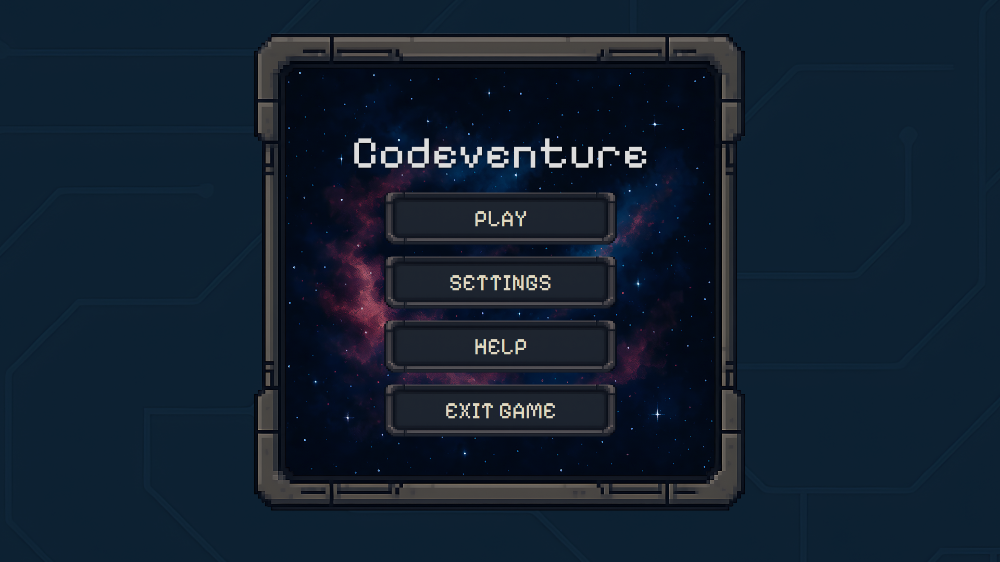
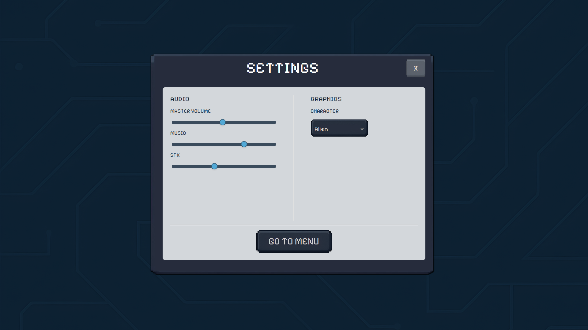
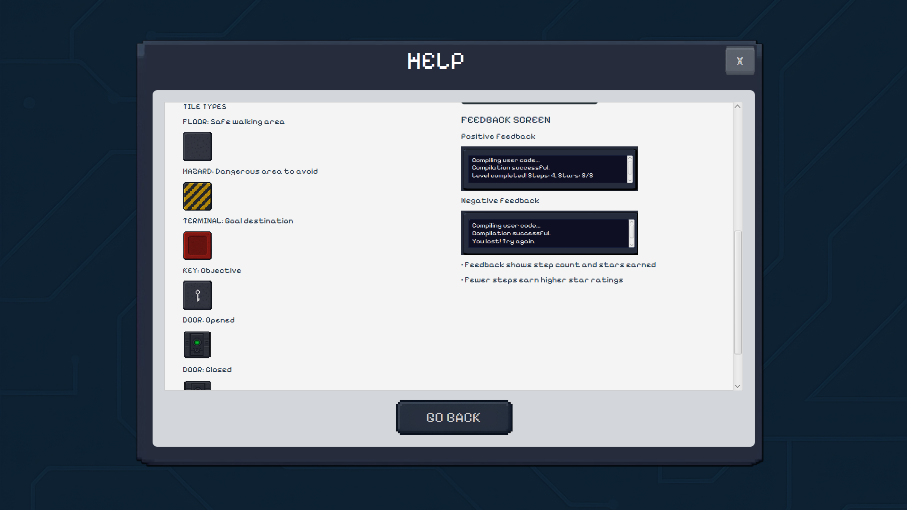
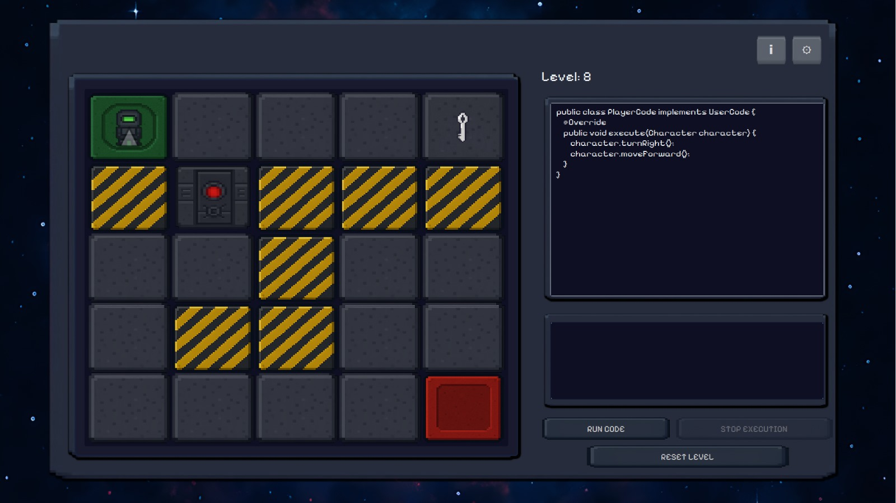
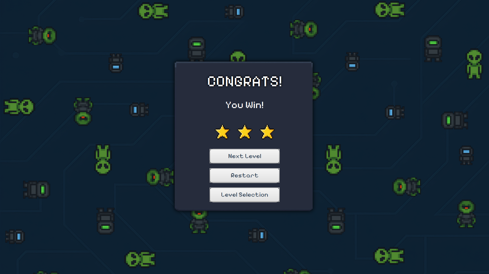
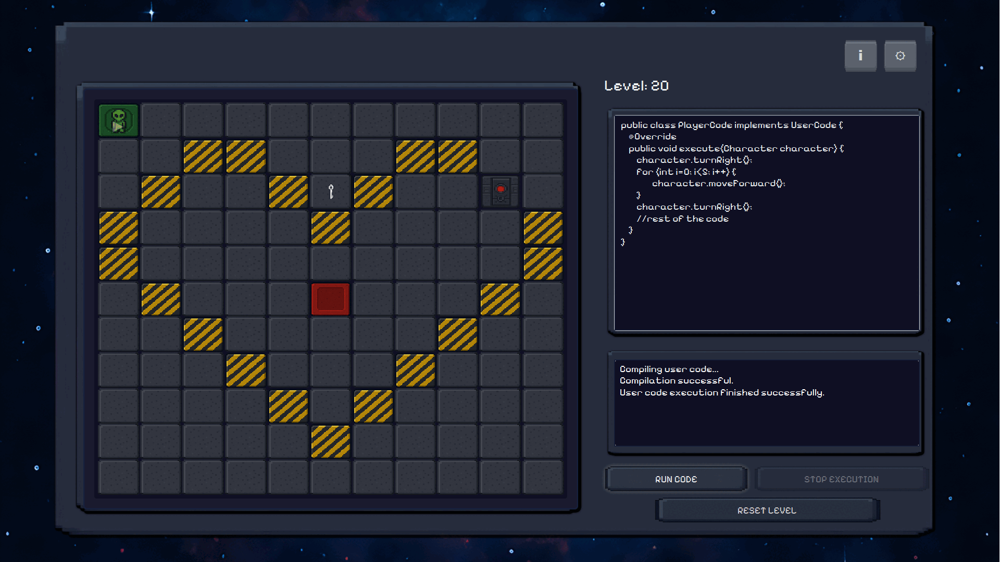

# Codeventure - coding game
Group Assignment 2IRR00 2025 Group 58
## Table of contents
* [Screenshots](#screenshots)
* [Introduction](#introduction)
* [Technologies](#technologies)
* [Installation](#installation)
* [Design Patterns](#design-patterns)
* [Intermediate Submissions](#intermediate-submissions)
* [License](#license)
* [Contributions](#contributions)
* [Project Status](#project-status)

## Screenshots

<table>
  <tr>
    <td valign="top">
      
      <p style="text-align:center;">Main Menu</p>
    </td>
    <td valign="top">
      
      <p style="text-align:center;">Settings</p>
    </td>
    <td valign="top">
      
      <p style="text-align:center;">Help Screen</p>
    </td>
  </tr>
  <tr>
    <td valign="top">
      
      <p style="text-align:center;">Level 8</p>
    </td>
    <td valign="top">
      
      <p style="text-align:center;">Level 20</p>
    </td>
    <td valign="top">
      
      <p style="text-align:center;">Victory / Level Completed</p>
    </td>
  </tr>
</table>

<p style="text-align:center;">
  
</p>

## Introduction
Codventure is a 2D educational game designed to teach programming basics in an interactive way. Players control a character on a grid-based map by writing simple Java code. The objective is to guide the character from a start point to an endpoint while avoiding obstacles and meeting level-specific challenges. The game features visual feedback, tutorials, and an enganging way for players to practice coding through play.

## Technologies
this project is created using:
* Java (JDK 21)
* JavaFX (17)

## Installation
Follow these steps to set up and run the game:
1. **Clone the repository**
   ```bash
    git clone https://github.com/TUe-MCS-2IRR00/2irr00-2025-group-assignment-graded-assignment-2irr00-2025-58.git
2. **Open the project in your preferred Java IDE** (e.g., Intellij IDEA, Eclipse).
3. **Set the project SDK to Java 21.**
4. **Run the game** (i.e. build the Maven project and run the `Launcher.java` class).

## Authors and acknowledgment
* **Dimitar Zhekov** — _Student ID: 2132966_ — `mitkozh` — d.z.zhekov@student.tue.nl
* **Sofia Constantinou** — _Student ID: 2127326_ — `sofiaconst` — s.c.constantinou@student.tue.nl
* **Stefanos Kritikos** — _Student ID: 2153785_ — `stefkrit27` — s.kritikos@student.tue.nl
* **Alex Christou** — _Student ID: 2075407_ — `alexchristou06` — a.christou@student.tue.nl
* **Efe Koç** — _Student ID: 2098156_ — `techinesis` — e.koc@student.tue.nl
* **Nicole Almeida** —  _Student ID: 2087480_ — `nicolealm1405` —  n.e.almeida@student.tue.nl

## Design Patterns  
We applied the following design patterns in our project:
* **Observer Pattern**  
Used to decouple parts of the UI or logic when game state changes (e.g., level won/lost, grid updates).
* **Singleton Pattern**  
So only one instance of core services (like `AudioManagerServiceImpl`, `NavigationManager`, `LevelServiceImpl`) exists and provides a global access point.
* **DTO (Data Transfer Object) Pattern**  
`LevelDTO` and similar classes are used to transfer structured data between layers (e.g., from service to controller) without exposing internal details.
* **MVC (Model-View-Controller) Pattern**  
Separates application logic, UI, and user interaction handling in their respective packages (`model`,`GUI`, `controller`), for better organization and maintainability.
* **Facade Pattern**  
`GameScreenServiceFacade` provides a simplified interface to complex subsystems, making it easier for controllers to interact with multiple services.
* **Service Locator Pattern**  
`GameServiceManager` acts as a registry to provide and manage access to various services needed throughout the application.

## Intermediate Submissions
You can find our intermediate submissions here:
* [Submission 1](submissions/Intermediate_Submission_1_Group_58.pdf)
* [Submission 2](submissions/Intermediate_Submission_2_Group_58.pdf) 
* [Submission 3](submissions/Intermediate_Submission_3_Group_58.pdf)

## Reflections
You can find our reflections here:
* [Reflections](https://drive.google.com/drive/folders/1GEiDpqTCp3__CT5tuy0Lk11pN78lZ43Q?usp=sharing)

## Contributions
* Dimitar Zhekov — Project leader, tech lead, GUI and backend.
* Stefanos Kritikos — GUI and backend.
* Sofia Constantinou — Tests, GUI, some controllers.
* Alex Christou — Tests, backend and assignments.
* Efe Koç — Tests, asset collections, some services.
* Nicole Almeida — Styling and tests.
  
## License
This project was developed as a part of a group assignment for the 2IRR00 course at TU/e.  
It is intended for academic use only and is not licensed for commercial distribution.

## Project Status
This project has been completed and submitted as part of the 2IRR00 course at TU/e.  
We would love to continue working on this project in the future and develop it into a real application. :)
